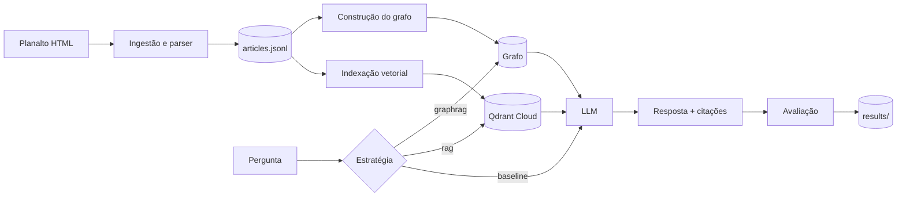

# SPEC — llm-lab-legislacao

> Laboratório incremental de técnicas com LLMs (prompting, RAG, GraphRAG e fine-tuning) aplicado à legislação brasileira de direito digital e do consumidor, usando provedores em nuvem via SDK compatível com a API da OpenAI.

| Campo | Valor |
|---|---|
| Status | Em desenvolvimento |
| Versão da spec | 1.0 |
| Licença do código | Apache-2.0 |
| Idioma | Código em inglês; documentação, issues, PRs e commits em português |

---

## 1. Objetivo

Construir um único sistema de perguntas e respostas sobre legislação que evolui em milestones. Cada milestone adiciona uma técnica e mede o ganho dela contra as anteriores, usando **sempre o mesmo conjunto de avaliação**. O produto final não é o chatbot em si, e sim a **comparação documentada** entre as abordagens: qualidade, custo e latência.

### 1.1 Escopo

- Ingestão e estruturação de textos legais.
- Conjunto de avaliação próprio e métricas automatizadas.
- Baseline com prompting, RAG vetorial, RAG avançado, GraphRAG e fine-tuning.
- Relatório comparativo reproduzível.

### 1.2 Fora de escopo

- Execução local de modelos (toda inferência, embedding e fine-tuning é feita via API).
- Interface web ou produto para usuários finais.
- Aconselhamento jurídico: o sistema é experimental e isso deve constar no README.

---

## 2. Domínio e dados

### 2.1 Corpus

| Lei | Número | Fonte |
|---|---|---|
| Lei Geral de Proteção de Dados (LGPD) | Lei 13.709/2018 | planalto.gov.br |
| Marco Civil da Internet | Lei 12.965/2014 | planalto.gov.br |
| Código de Defesa do Consumidor (CDC) | Lei 8.078/1990 | planalto.gov.br |

O corpus pode crescer em milestones futuros (ex.: Decreto 8.771/2016, regulamentos da ANPD), sempre via issue própria.

### 2.2 Regras de tratamento

- **Versão compilada.** Usar o texto compilado do Planalto e registrar a data de coleta e o hash do HTML bruto.
- **Dispositivos revogados e vetados.** O Planalto exibe texto riscado para redações antigas. O parser deve marcar esses dispositivos com `status: revogado | vetado | vigente` e **não** indexar os revogados por padrão.
- **Hierarquia.** Preservar Título → Capítulo → Seção → Artigo → Parágrafo → Inciso → Alínea.
- **Artigos acrescidos.** Tratar identificadores com sufixo (ex.: art. 55-A a 55-L da LGPD) como artigos próprios.
- **Remissões.** Extrair referências internas ("art. 7º") e externas ("Lei nº 8.078") como dados estruturados, pois elas alimentam o GraphRAG.

### 2.3 Schema do corpus (`data/processed/articles.jsonl`)

```json
{
  "id": "lgpd:art:7",
  "law": "lgpd",
  "article": "7",
  "path": ["Capítulo II", "Seção I"],
  "status": "vigente",
  "text": "Art. 7º O tratamento de dados pessoais somente poderá ser realizado...",
  "units": [{"type": "inciso", "id": "I", "text": "..."}],
  "references": [{"target": "lgpd:art:11", "raw": "art. 11"}],
  "source_hash": "sha256:...",
  "collected_at": "2026-09-24"
}
```

---

## 3. Arquitetura



Toda estratégia implementa a mesma interface, para que o runner de avaliação trate todas igualmente:

```python
class Strategy(Protocol):
    name: str

    def answer(self, question: str) -> Answer: ...


class Answer(BaseModel):
    text: str
    cited_articles: list[str]  # ex.: ["lgpd:art:7"]
    retrieved_ids: list[str]  # vazio para baseline
    usage: Usage  # tokens e custo estimado
    latency_ms: int
```

---

## 4. Provedores em nuvem

### 4.1 Princípio

Todo acesso a modelos passa por **um único módulo cliente** (`src/lab/llm/client.py`) baseado no SDK `openai`, configurado por `base_url` e `api_key`. Trocar de provedor deve exigir apenas mudança de configuração, nunca de código.

Exemplos de provedores com endpoint compatível: OpenRouter (agregador de vários modelos), Together AI, Fireworks AI, DeepInfra e Groq. A escolha inicial é registrada em ADR (seção 8.7). Verifique a documentação atual de cada provedor, pois modelos e preços mudam com frequência.

### 4.2 Papéis de modelo

Cada chamada usa um **papel**, não um modelo fixo. Os papéis ficam em `config/models.yaml`:

```yaml
roles:
  generator:   { provider: openrouter, model: "<id-do-modelo>", price_in: 0.00, price_out: 0.00 }
  judge:       { provider: openrouter, model: "<id-de-outro-modelo>", price_in: 0.00, price_out: 0.00 }
  embedding:   { provider: deepinfra,  model: "BAAI/bge-m3", dims: 1024, price_in: 0.00 }
  synthesizer: { provider: together,   model: "<id-do-modelo>", price_in: 0.00, price_out: 0.00 }

providers:
  openrouter: { base_url: "https://openrouter.ai/api/v1", api_key_env: OPENROUTER_API_KEY }
  deepinfra:  { base_url: "https://api.deepinfra.com/v1/openai", api_key_env: DEEPINFRA_API_KEY }
  together:   { base_url: "https://api.together.xyz/v1", api_key_env: TOGETHER_API_KEY }
```

Preços são em US$ por 1M de tokens e preenchidos manualmente a partir da página do provedor. **O modelo juiz deve ser de família diferente do gerador**, para reduzir viés de autoavaliação.

### 4.3 Requisitos do cliente

- Retentativas com backoff exponencial para erros 429 e 5xx.
- Timeout configurável por papel.
- Registro de tokens de entrada/saída e custo estimado em toda chamada.
- **Cache em disco** (SQLite) chaveado por hash de `(modelo, mensagens, parâmetros)`, ligado por padrão na avaliação. Isso torna reruns gratuitos e resultados reproduzíveis.
- Saída estruturada via `response_format` com JSON Schema quando o provedor suportar, com fallback para parsing validado por Pydantic.

### 4.4 Serviços de armazenamento

| Serviço | Uso | Observação |
|---|---|---|
| Qdrant Cloud | Índice vetorial | Plano gratuito atende o corpus; testes usam `QdrantClient(":memory:")` |
| Grafo | GraphRAG | Começa com NetworkX serializado em arquivo; Neo4j AuraDB é opcional via ADR |

### 4.5 Variáveis de ambiente (`.env.example`)

```dotenv
OPENROUTER_API_KEY=
DEEPINFRA_API_KEY=
TOGETHER_API_KEY=
QDRANT_URL=
QDRANT_API_KEY=
LAB_MAX_USD_PER_RUN=2.00
LAB_CACHE_DIR=.cache/llm
# opcionais: tracing no Langfuse (desligado se ausentes)
LANGFUSE_PUBLIC_KEY=
LANGFUSE_SECRET_KEY=
LANGFUSE_HOST=
```

---

## 5. Stack técnica

| Área | Ferramenta |
|---|---|
| Linguagem | Python 3.12 |
| Pacotes e ambiente | uv |
| Cliente LLM | openai (SDK) |
| Validação e config | pydantic, pydantic-settings |
| CLI | typer |
| Vetores | qdrant-client |
| Busca lexical | rank-bm25 |
| Grafo | networkx; LightRAG (avaliado no M6) |
| Testes | pytest, pytest-cov, respx (mock HTTP) |
| Lint e formatação | ruff |
| Tipos | pyright (modo strict em `src/`) |
| Observabilidade | Langfuse (opcional; avaliado no M2) |
| Hooks | pre-commit |
| CI | GitHub Actions |
| Gráficos do relatório | matplotlib |

Dependências são adicionadas **na issue que as usa**, não antecipadamente.

---

## 6. Estrutura do repositório

```
llm-lab-legislacao/
├── SPEC.md
├── README.md
├── LICENSE
├── CHANGELOG.md
├── .env.example
├── pyproject.toml
├── config/
│   ├── models.yaml
│   └── experiments/          # um YAML por experimento
├── prompts/                  # prompts versionados (v1.md, v2.md...)
├── data/
│   ├── raw/                  # HTML coletado (gitignored, reprodutível via CLI)
│   ├── processed/            # articles.jsonl (versionado)
│   ├── eval/                 # conjunto de avaliação (versionado)
│   └── train/                # dados de fine-tuning (versionado)
├── src/lab/
│   ├── cli.py
│   ├── settings.py
│   ├── llm/                  # cliente, cache, custos
│   ├── ingest/               # coleta e parser
│   ├── index/                # embeddings e Qdrant
│   ├── graph/                # construção e consulta do grafo
│   ├── strategies/           # baseline, rag, graphrag, finetuned
│   ├── eval/                 # runner, métricas, juiz
│   └── finetune/             # geração de dataset e jobs
├── results/                  # uma pasta por run de avaliação
├── reports/                  # relatório comparativo
├── docs/adr/                 # decisões de arquitetura
├── tests/
└── scripts/bootstrap_github.sh
```

Notebooks só são permitidos em `notebooks/` para exploração, nunca como fonte de resultados oficiais.

---

## 7. Avaliação

### 7.1 Schema do conjunto (`data/eval/questions.jsonl`)

```json
{
  "id": "q001",
  "question": "Qual o prazo para o controlador responder a um pedido de confirmação de tratamento em formato simplificado?",
  "reference_answer": "Imediatamente.",
  "gold_articles": ["lgpd:art:19"],
  "category": "factual",
  "laws": ["lgpd"]
}
```

### 7.2 Categorias e distribuição (80 perguntas)

| Categoria | Qtde | O que testa |
|---|---|---|
| `factual` | 25 | Resposta em um único artigo |
| `multi_artigo` | 15 | Combinação de artigos da mesma lei |
| `multi_lei` | 15 | Relação entre leis diferentes |
| `numerica` | 10 | Prazos, valores e percentuais |
| `sem_resposta` | 15 | Perguntas fora do corpus; o correto é se abster |

As perguntas são escritas manualmente. Perguntas geradas por LLM só entram após revisão, marcadas com `"origin": "synthetic_reviewed"`. O conjunto é **congelado** ao fim do M2; mudanças posteriores geram nova versão (`questions.v2.jsonl`) e invalidam comparações diretas com runs antigos.

### 7.3 Métricas

| Métrica | Tipo | Definição |
|---|---|---|
| Correção | LLM-as-judge | Nota 0/1/2 por rubrica fixa em `prompts/judge.md` |
| Citação correta | Determinística | Interseção entre `cited_articles` e `gold_articles` |
| Recall@k e MRR | Determinística | Posição dos `gold_articles` em `retrieved_ids` |
| Fidelidade | LLM-as-judge | A resposta é sustentada pelo contexto recuperado? |
| Abstenção | Determinística + juiz | Acerto em `sem_resposta` e taxa de recusa indevida |
| Custo | Registro | US$ total e por pergunta |
| Latência | Registro | p50 e p95 em ms |

O juiz é validado no M2 contra 20 respostas anotadas manualmente. Se a concordância for menor que 80%, a rubrica é revisada antes de qualquer comparação.

### 7.4 Registro de runs

Cada execução gera `results/<AAAAMMDD-HHMM>-<estrategia>/` com:

- `config.yaml`: experimento, papéis de modelo, versão do prompt e do dataset.
- `meta.json`: SHA do commit, flag de árvore suja, custo total, duração.
- `answers.jsonl`: respostas individuais.
- `metrics.json`: agregados gerais e por categoria.

**Um resultado só vale para o relatório se foi gerado a partir de um commit limpo.** O runner aborta se o custo estimado ultrapassar `LAB_MAX_USD_PER_RUN`.

---

## 8. Regras de desenvolvimento

### 8.1 Fluxo de trabalho

1. Todo trabalho nasce de uma issue vinculada a um milestone.
2. Branch criada a partir da issue:
   `gh issue develop <N> --name <tipo>/<N>-<slug> --checkout`
3. Commits pequenos, um por mudança lógica.
4. PR com `Closes #<N>` no corpo, preenchendo o template.
5. Merge com **merge commit** (`gh pr merge --merge --delete-branch`) para preservar o histórico. Squash não é usado.

### 8.2 Branches

`<tipo>/<numero-da-issue>-<slug-curto>`. Exemplos: `feat/14-parser-artigos`, `fix/22-incisos-revogados`, `exp/31-chunking-paragrafo`.

### 8.3 Commits (Conventional Commits)

Formato: `<tipo>(<escopo>): <descrição no imperativo> (#<issue>)`

| Tipo | Uso |
|---|---|
| `feat` | Nova funcionalidade |
| `fix` | Correção |
| `refactor` | Mudança sem alterar comportamento |
| `test` | Testes |
| `docs` | Documentação |
| `exp` | Experimento e seus resultados |
| `data` | Alteração em dados versionados |
| `chore` | Build, CI, dependências |

Escopos correspondem aos módulos de `src/lab/` (`llm`, `ingest`, `index`, `graph`, `strategies`, `eval`, `finetune`, `cli`).

### 8.4 Pull requests

- Uma issue por PR.
- Tamanho-alvo de até ~400 linhas alteradas, excluindo dados e resultados. Acima disso, dividir a issue.
- O autor faz auto-revisão lendo o diff completo no GitHub antes do merge.
- PRs de experimento (`exp`) devem incluir a tabela de métricas no corpo.

### 8.5 Definição de pronto

- CI verde (ruff, pyright, pytest).
- Código novo com testes; cobertura de `src/` não cai abaixo de 80%.
- Nenhuma chamada real de API em testes unitários (usar `respx` ou fakes).
- Testes que chamam APIs reais recebem `@pytest.mark.api` e rodam só manualmente (`uv run pytest -m api`).
- README ou docs atualizados se o comportamento visível mudou.
- Entrada adicionada em `CHANGELOG.md` na seção `Unreleased`.

### 8.6 Proteção da `main`

- Push direto bloqueado; merge só via PR.
- Checks de CI obrigatórios.
- Zero aprovações exigidas (projeto individual).

### 8.7 ADRs

Decisões com alternativas reais viram um ADR em `docs/adr/NNNN-titulo.md` (contexto, opções, decisão, consequências). ADRs obrigatórios: escolha de provedores, estratégia de chunking, biblioteca de GraphRAG e provedor de fine-tuning.

### 8.8 Segredos e custos

- `.env` no `.gitignore`; segredos do CI em GitHub Secrets.
- Chaves nunca aparecem em logs, resultados ou mensagens de erro.
- Definir limite de gasto mensal no painel de cada provedor, além do limite por run.

---

## 9. Versionamento e releases

SemVer com uma versão menor por milestone. Ao fechar um milestone:

```bash
git tag -a v0.X.0 -m "Milestone MX concluído" && git push origin v0.X.0
gh release create v0.X.0 --generate-notes
```

O `--generate-notes` monta as notas a partir dos PRs mergeados. `v1.0.0` corresponde ao relatório final publicado.

---

## 10. Milestones

Cada milestone tem critérios de aceite verificáveis; ele só é fechado quando todos são atendidos.

### M0 — Fundação (`v0.1.0`)

Infraestrutura para desenvolver e chamar modelos com segurança.

- Licença, README inicial, `.gitignore` e `.env.example`
- Projeto uv com ruff, pyright, pytest e pre-commit
- Workflow de CI no GitHub Actions
- Templates de issue e de PR
- Proteção da branch `main`
- Settings com pydantic-settings e `config/models.yaml`
- Cliente OpenAI-compatible com retentativas, timeout e registro de custo
- Cache de respostas em SQLite
- Comando `lab chat` para teste manual de um papel de modelo
- ADR 0001: escolha de provedores

**Aceite:** `uv run lab chat --role generator "olá"` responde e exibe tokens e custo; CI verde na `main`.

### M1 — Corpus (`v0.2.0`)

Textos legais estruturados e confiáveis.

- Coletor das três leis com hash e data de coleta
- Parser da hierarquia até alínea
- Detecção de dispositivos revogados e vetados
- Suporte a artigos acrescidos (ex.: 55-A)
- Extração de remissões internas e externas
- Exportação para `articles.jsonl` com validação de schema
- Testes do parser com fixtures de HTML
- Comando `lab ingest`

**Aceite:** número de artigos de cada lei confere com a contagem manual do texto oficial; 20 artigos amostrados conferidos manualmente sem divergência.

### M2 — Avaliação (`v0.3.0`)

A régua que mede todas as fases seguintes.

- Schema e validador do conjunto de avaliação
- Escrita das 80 perguntas nas cinco categorias
- Runner de avaliação com paralelismo, cache e limite de custo
- Métricas determinísticas (citação, recall@k, MRR, abstenção)
- Juiz LLM com rubrica versionada
- Validação do juiz contra 20 anotações manuais
- Registro de runs em `results/`
- Comando `lab compare` entre runs
- Avaliação do Langfuse para rastreamento de chamadas e runs (integração opcional + ADR)

`results/` continua sendo a fonte oficial dos resultados; o Langfuse, se adotado, é uma camada de inspeção complementar.

**Aceite:** concordância juiz × anotação humana ≥ 80%; dataset congelado com tag `eval-v1`.

### M3 — Baseline de prompting (`v0.4.0`)

Quanto o modelo sabe sem recuperação.

- Interface `Strategy` e estratégia `baseline`
- System prompt v1 (zero-shot)
- Variante few-shot
- Saída estruturada com resposta, artigos citados e confiança
- Estratégia `long_context`: lei inteira no prompt
- Comparação entre ao menos dois modelos de tamanhos diferentes

**Aceite:** runs registrados para todas as variantes; tabela comparativa no PR de fechamento.

### M4 — RAG vetorial (`v0.5.0`)

Recuperação densa básica.

- Geração de embeddings via API com processamento em lote
- Coleção no Qdrant Cloud com payload de metadados
- Chunking por artigo
- Variante de chunking por parágrafo ou inciso
- Estratégia `rag` com citações obrigatórias
- Experimento de variação de k (3, 5, 10)
- ADR: estratégia de chunking

**Aceite:** recall@5 e correção reportados por categoria; ganho ou perda versus M3 explicado no PR.

### M5 — RAG avançado (`v0.6.0`)

Técnicas que atacam as falhas encontradas no M4.

- Busca híbrida (BM25 + densa) com fusão RRF
- Reranking via API
- Reescrita de consulta
- Expansão por remissões (incluir artigos citados pelos recuperados)
- Filtro por lei via metadados
- Análise de erros das perguntas que continuam falhando

**Aceite:** cada técnica medida isoladamente (ablação), não só combinada.

### M6 — GraphRAG (`v0.7.0`)

Relações entre dispositivos e entre leis.

- Grafo estrutural determinístico (hierarquia + remissões)
- Extração de entidades e relações via LLM (agentes, direitos, obrigações, sanções, prazos)
- Avaliação de LightRAG versus implementação própria
- Estratégia `graphrag` com modos local e global
- Visualização de subgrafos para depuração
- ADR: biblioteca de GraphRAG

**Aceite:** comparação com M4 e M5 por categoria, com foco em `multi_artigo` e `multi_lei`; custo de construção do grafo reportado à parte.

### M7 — Fine-tuning (`v0.8.0`)

Quando ajustar o modelo compensa em relação a recuperar contexto.

- Geração de dataset sintético de treino a partir do corpus
- Checagem de vazamento contra o conjunto de avaliação
- Split treino/validação em formato chat JSONL
- Job de fine-tuning LoRA via API do provedor
- Estratégias `finetuned` e `finetuned_rag`
- Análise de custo de treino versus economia de inferência
- ADR: provedor de fine-tuning

**Aceite:** nenhuma pergunta de avaliação com similaridade alta demais no treino (limiar definido no ADR); resultados do modelo ajustado com e sem RAG.

### M8 — Relatório e portfólio (`v1.0.0`)

Consolidar e comunicar os resultados.

- Relatório comparativo com gráficos gerado por script
- Seção de limitações e ameaças à validade
- README final com diagrama e instruções de reprodução
- Artigo de divulgação

**Aceite:** um terceiro consegue reproduzir as tabelas do relatório seguindo apenas o README.

### Backlog (sem milestone)

- Agente com uso de ferramentas (busca, navegação no grafo)
- Expansão do corpus
- API HTTP para consulta
- Tema "System one" (a definir)

---

## 11. Licenciamento

| Artefato | Licença | Observação |
|---|---|---|
| Código-fonte | Apache-2.0 | Permissiva e com concessão explícita de patentes |
| Textos legais | Domínio público | Lei 9.610/1998, art. 8º, IV |
| Conjunto de avaliação e anotações | CC BY 4.0 | Criação própria |
| Dataset sintético de treino | CC BY 4.0, sujeito aos termos do provedor | Ver nota abaixo |
| Adaptadores fine-tuned | Herdam a licença do modelo base | Verificar antes de publicar |

**Nota sobre dados sintéticos:** alguns provedores restringem o uso das saídas de seus modelos para treinar outros modelos. Antes do M7, verificar os termos de uso do modelo com papel `synthesizer` e registrar a conclusão no ADR de fine-tuning.

O README deve conter o aviso: *"Projeto experimental e educacional. As respostas geradas não constituem aconselhamento jurídico."*

---

## 12. Decisões em aberto

| Tema | Quando decidir |
|---|---|
| Provedores iniciais de cada papel | M0 (ADR 0001) |
| Adoção do Langfuse (cloud ou self-hosted) | M2 |
| Estratégia final de chunking | M4 |
| LightRAG versus implementação própria | M6 |
| Provedor de fine-tuning e modelo base | M7 |
| Escopo do tema "System one" | Antes de entrar em um milestone |
